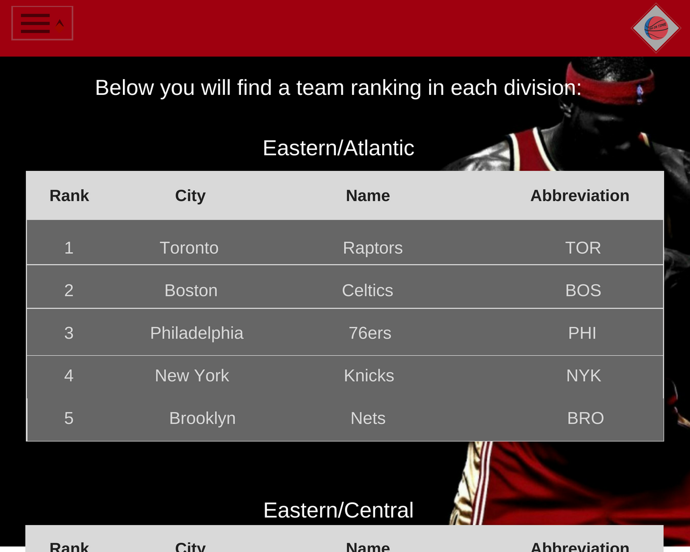
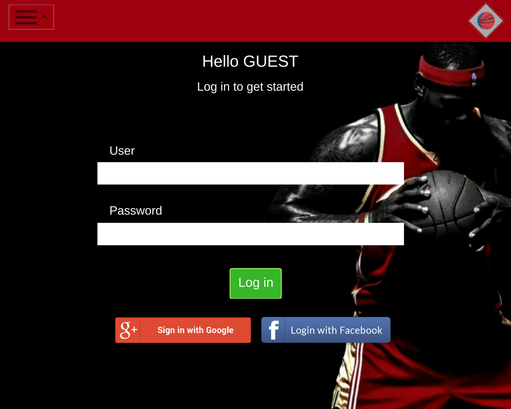

# Opis

Głównym celem naszego projektu jest usprawnienie przeglądania informacji na temat wybranego zespołu koszykarskiego. Użytkownik będzie miał możliwość zalogowania się, uzyskania w prosty sposób pożądanych informacji na temat danej drużyny, wybrania tematyki tagów do później wyświetlanych artykułów, a także kanałów i filmów, z których zawartością chciałby być na bieżąco.
Aplikacja będzie współpracować między innymi z API Yahoo Sport...
Do zrealizowania powyższego zostanie użytych kilka narzędzi, między innymi: baza danych Google Firebase, elementy frameworku AngularJS oraz innych narzędzi pomocniczych. 

## Skład zespołu projektowego
1. Katarzyna Zdeb
2. Dominik Woźniczka
3. Jakub Szerszeń

## System zarządzania projektem:
https://trello.com/b/N8pHG4K3/projekt-spa

## Aplikacja:
https://nba-be879.firebaseapp.com

## Prototypy:

## Raport pracy każdego członka zespołu:
Jakub Szerszeń: 
    stworzenie szkieletu projektu(5godziny), dodanie firebase do aplikacji(5godziny), stworzenie logowania przez facebook oraz konto google(20godziny), dodanie możliwości logowania przez e-mail(10godziny), dodawanie ulubionej drużyny(3,5godziny), naprawa błędów(7godzin), tworzenie logo(2godziny), szukanie nowego API z wyikami(3godziny), uzyskanie dostępu do nowego API(2godziny), stworzenie servisu http(10godzin),stworzenie niezbędnych interfaców do wyświetlania pobranego API(2godziny), wyświetlenie podstawowych informacji z api(3godziny), rozwiązanie prodlemu z pobieraniem wyniku przez datę(3godziny), pobieranie informacji z bazy danych w celu wyświetlania przycisku ulubionej drużyny(3godziny)
    Łączny czas wykonania pracy: 78,5 godziny

Dominik Woźniczka:
    stworzenie navbara i oprawy graficznej (10 godzin), tworzenie komponentów do wyświetlania zawartości aplikacji (3 godziny), stworzenie routingu i połączenie go do odpowiednich sekcji aplikacji (4,5 godzin), instalacja i implementacja youtube player jako podstawy do wyswietlania filmów w aplikacji (2,5 godziny), nanoszenie poprawek i "kosmetyka" (4,5 godziny), naprawa błędów i konfiguracja środowiska (7,5 godziny)
    Łączny czas wykonania pracy: 32 godziny
    
Katarzyna Zdeb:
   stworzenie prototypu projektu (5 godzin) szukanie rozwiązania problemu pobierania informacji z api nba(17 godzin) próby stworzenie serwisu http i odczytywania danych(5 godzin) dodawanie serwisu youtube próba połączenia z YouTubeAPI (22 godziny), zmiana narzędzia na gotowy komponent i próby ulepszania, rozszerzenie zakładki Youtube (5 godzin), znalezienie i dodanie filmów do każdej drużyny (3 godziny), poprawa prototypu (3 godziny) 
   Łączny czas pracy:  60 godzin

