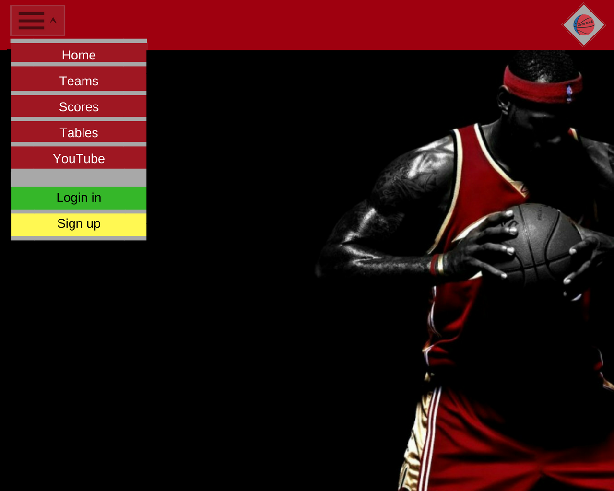
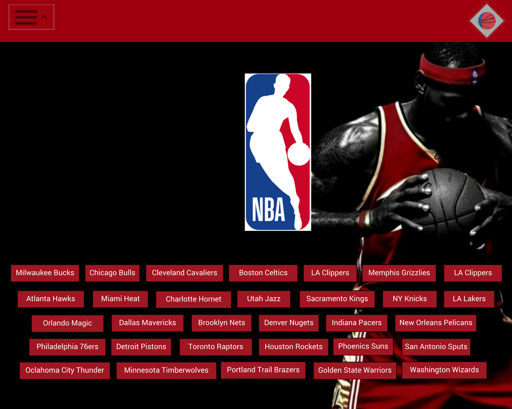
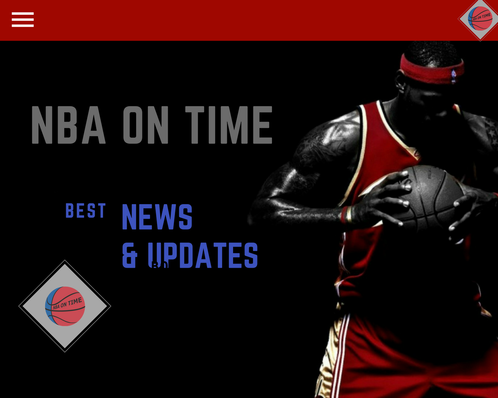

# Opis

Głównym celem naszego projektu jest usprawnienie przeglądania informacji na temat wybranego zespołu koszykarskiego. Użytkownik będzie miał możliwość zalogowania się, uzyskania w prosty sposób pożądanych informacji na temat danej drużyny, wybrania tematyki tagów do później wyświetlanych artykułów, a także kanałów i filmów, z których zawartością chciałby być na bieżąco.
Aplikacja będzie współpracować między innymi z API Yahoo Sport...
Do zrealizowania powyższego zostanie użytych kilka narzędzi, między innymi: baza danych Google Firebase, elementy frameworku AngularJS oraz innych narzędzi pomocniczych. 

## Skład zespołu projektowego
1. Katarzyna Zdeb
2. Dominik Woźniczka
3. Jakub Szerszeń

## System zarządzania projektem:
https://trello.com/b/N8pHG4K3/projekt-spa

##Aplikacja:
https://nba-be879.firebaseapp.com

## Prototypy:

## Raport pracy każdego członka zespołu:
Jakub Szerszeń: 
    -stworzenie szkieletu projektu(5godziny), dodanie firebase do aplikacji(5godziny), stworzenie logowaania przez facebook oraz konto google(20godziny), dodanie możliwości logowania przez e-mail(10godziny), dodawanie ulubionej drużyny(3,5godziny), naprawa błędów(7godzin). 
    -Łączny czas wykonania pracy: 50,5 godziny

